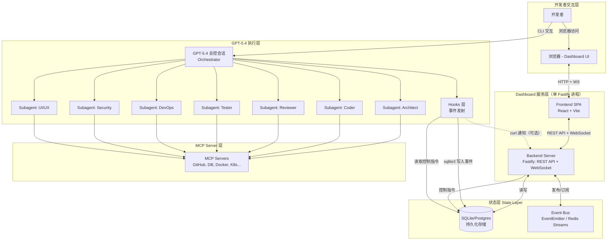
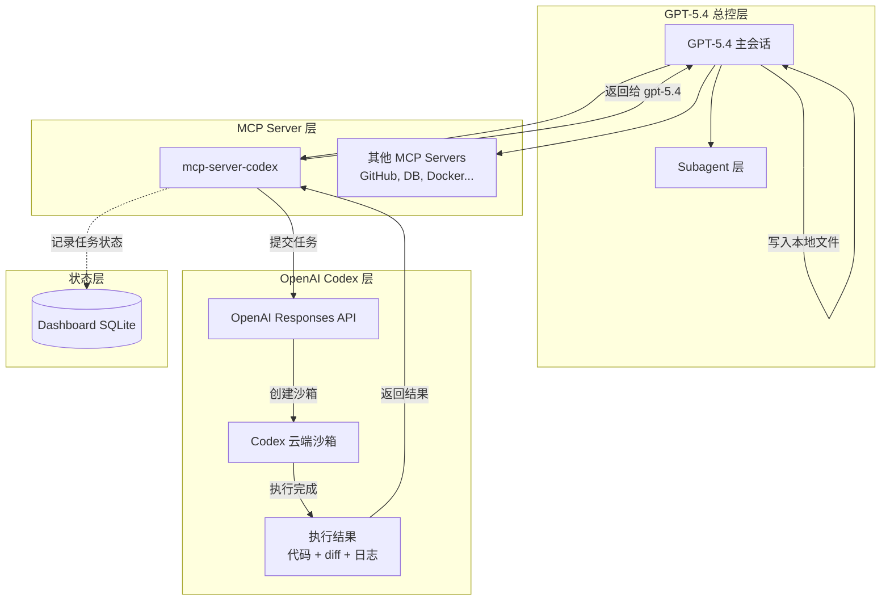

# 多智能体协同开发助手架构设计方案

## Context

作为高级全栈工程师（开发+运维+安全+UI/UE），需要一套覆盖完整开发生命周期的个人 AI 开发助手系统。技术栈混合、部署方式混合。

核心思路：以 **`gpt-5.4` 总控层**为编排中枢，通过 **CLAUDE.md 指令系统 + MCP Servers + Hooks + Subagents** 构建多个专业 Agent 角色，并把具体编码执行统一下发给 **`gpt-5.3-codex`**。

---

## 架构总览

```
┌──────────────────────────────────────────────────────────────────┐
│                        你 (开发者)                                 │
│                     │            │                                 │
│                     ▼            ▼                                 │
│           ┌──────────────┐  ┌───────────────────┐                 │
│           │ GPT-5.4 总控层 │  │  Web Dashboard    │  ← 可视化控制台│
│           │ 交互 / 编排    │  │  (观察/控制/配置)  │                │
│           └──────┬───────┘  └────────┬──────────┘                 │
│                  │                   │                             │
│                  │    ┌──────────────┘                             │
│                  ▼    ▼                                            │
│        ┌──────────────────────────────┐                           │
│        │     状态层 State Layer        │  ← 事件 + 控制信号       │
│        │  (SQLite + Event Bus)        │                           │
│        └──────────────┬───────────────┘                           │
│                       │                                           │
│              ┌────────┴────────┐                                  │
│              │  GPT-5.4 会话     │  ← 编排中枢                     │
│              │  (Orchestrator)  │                                  │
│              └────────┬────────┘                                  │
│                       │                                           │
│         ┌─────────────┼─────────────┐                             │
│         ▼             ▼             ▼                             │
│   ┌──────────┐ ┌──────────┐ ┌──────────┐                         │
│   │ Subagent │ │ Subagent │ │ Subagent │  ← 专业 Agent           │
│   │ 层       │ │ 层       │ │ 层       │                          │
│   └────┬─────┘ └────┬─────┘ └────┬─────┘                         │
│        │             │             │                               │
│        ▼             ▼             ▼                               │
│   ┌──────────────────────────────────────┐                        │
│   │         MCP Server 层                 │  ← 工具能力           │
│   │  (GitHub, DB, Docker, K8s, Browser…) │                        │
│   └──────────────────────────────────────┘                        │
│        │             │             │                               │
│        ▼             ▼             ▼                               │
│   ┌──────────────────────────────────────┐                        │
│   │         Hooks 层                      │  ← 自动化触发 + 事件发射│
│   │  (pre-commit, post-edit, CI trigger) │                        │
│   └──────────────────────────────────────┘                        │
└──────────────────────────────────────────────────────────────────┘
```

---

## 一、Agent 角色定义（7 个专业 Agent）

### Agent 1: 🏗️ Architect（架构师）

**职责**: 系统设计、技术选型、架构评审、API 设计

**触发方式**: `gpt-5.4` 总控会话 / `/architect` slash command

**CLAUDE.md 角色指令**:
```
你是一位资深架构师。负责：
- 分析需求并输出架构设计文档（C4 模型）
- 技术选型对比与推荐
- API 契约设计（OpenAPI/GraphQL schema）
- 数据库 schema 设计
- 识别性能瓶颈和扩展性风险
输出格式：Markdown 设计文档 + Mermaid 架构图
```

**需要的 MCP Servers**:

| MCP Server | 用途 | 包/仓库 |
|---|---|---|
| filesystem | 读写设计文档 | `@anthropic-ai/mcp-server-filesystem` |
| github | 查看现有仓库结构 | `@anthropic-ai/mcp-server-github` |
| fetch | 查阅技术文档/RFC | `@anthropic-ai/mcp-server-fetch` |

---

### Agent 2: 💻 Coder（开发工程师）

**职责**: 功能开发、代码编写、重构

**触发方式**: `gpt-5.4` 总控会话下发编码任务 / general-purpose subagent

**CLAUDE.md 角色指令**:
```
你是一位全栈开发工程师。负责：
- 根据架构设计实现功能代码
- 遵循项目代码规范和设计模式
- 编写单元测试和集成测试
- 代码重构和性能优化
原则：最小改动、不过度设计、先跑通再优化
```

**需要的 MCP Servers**:

| MCP Server | 用途 | 包/仓库 |
|---|---|---|
| filesystem | 代码读写 | `@anthropic-ai/mcp-server-filesystem` |
| github | PR/Issue 管理 | `@anthropic-ai/mcp-server-github` |
| postgres | 数据库查询/迁移 | `@anthropic-ai/mcp-server-postgres` |
| redis | 缓存操作 | `@modelcontextprotocol/server-redis` |
| sqlite | 轻量数据库 | `@anthropic-ai/mcp-server-sqlite` |

---

### Agent 3: 🔍 Reviewer（代码审查员）

**职责**: 代码审查、质量把关、最佳实践检查

**触发方式**: Hooks (post-commit / pre-push) 自动触发 / `/review` slash command

**CLAUDE.md 角色指令**:
```
你是一位严格的代码审查员。负责：
- 审查代码变更的正确性、可读性、可维护性
- 检查安全漏洞（OWASP Top 10）
- 检查性能问题和内存泄漏风险
- 验证测试覆盖率是否充分
- 检查 API 契约一致性
输出格式：逐文件审查意见 + 严重程度标记（🔴🟡🟢）
```

**需要的 MCP Servers**:

| MCP Server | 用途 | 包/仓库 |
|---|---|---|
| github | PR diff 审查 | `@anthropic-ai/mcp-server-github` |
| eslint | JS/TS 静态分析 | `mcp-server-eslint` |
| sonarqube | 代码质量扫描 | 社区: `mcp-server-sonarqube` |

---

### Agent 4: 🧪 Tester（测试工程师）

**职责**: 测试策略、测试编写、E2E 测试、性能测试

**触发方式**: general-purpose subagent / `/test-gen` slash command

**CLAUDE.md 角色指令**:
```
你是一位测试工程师。负责：
- 根据需求编写测试用例（单元/集成/E2E）
- 使用 Playwright 进行 UI 自动化测试
- 使用 k6/Artillery 进行性能测试
- 分析测试覆盖率报告并补充测试
- 编写 API 契约测试
原则：测试金字塔、边界值优先、关键路径必覆盖
```

**需要的 MCP Servers**:

| MCP Server | 用途 | 包/仓库 |
|---|---|---|
| playwright | 浏览器自动化/E2E | `@anthropic-ai/mcp-server-playwright` |
| filesystem | 测试文件读写 | `@anthropic-ai/mcp-server-filesystem` |
| postgres | 测试数据准备 | `@anthropic-ai/mcp-server-postgres` |

---

### Agent 5: 🚀 DevOps（运维工程师）

**职责**: CI/CD、容器化、部署、基础设施管理

**触发方式**: general-purpose subagent / `/deploy` slash command

**CLAUDE.md 角色指令**:
```
你是一位 DevOps 工程师。负责：
- Dockerfile 和 docker-compose 编写优化
- CI/CD pipeline 配置（GitHub Actions / GitLab CI）
- Kubernetes manifests / Helm charts 编写
- Terraform/Pulumi IaC 编写
- 部署策略设计（蓝绿/金丝雀/滚动）
- 日志和监控配置
原则：基础设施即代码、不可变部署、最小权限
```

**需要的 MCP Servers**:

| MCP Server | 用途 | 包/仓库 |
|---|---|---|
| docker | 容器管理 | `mcp-server-docker` |
| kubernetes | K8s 集群操作 | `mcp-server-kubernetes` |
| github | CI/CD 配置 | `@anthropic-ai/mcp-server-github` |
| aws | AWS 资源管理 | 社区: `mcp-server-aws` |
| cloudflare | CF Workers/DNS | 社区: `mcp-server-cloudflare` |

---

### Agent 6: 🛡️ Security（安全工程师）

**职责**: 安全审计、漏洞扫描、合规检查、渗透测试辅助

**触发方式**: Hooks (pre-push) 自动触发 / `/security-audit` slash command

**CLAUDE.md 角色指令**:
```
你是一位安全工程师。负责：
- 依赖漏洞扫描（npm audit / pip audit / trivy）
- SAST 静态安全分析
- Secret 泄露检测（硬编码密钥/token）
- Docker 镜像安全扫描
- OWASP Top 10 合规检查
- 安全配置审计（CORS, CSP, HTTPS, 认证授权）
输出格式：安全报告 + 风险等级 + 修复建议
```

**需要的 MCP Servers**:

| MCP Server | 用途 | 包/仓库 |
|---|---|---|
| filesystem | 扫描代码文件 | `@anthropic-ai/mcp-server-filesystem` |
| github | 查看 Dependabot alerts | `@anthropic-ai/mcp-server-github` |
| docker | 镜像扫描 | `mcp-server-docker` |
| fetch | 查询 CVE 数据库 | `@anthropic-ai/mcp-server-fetch` |

---

### Agent 7: 🎨 UI/UX（设计工程师）

**职责**: UI 组件开发、设计系统维护、可访问性、响应式设计

**触发方式**: general-purpose subagent / `/ui-check` slash command

**CLAUDE.md 角色指令**:
```
你是一位 UI/UX 工程师。负责：
- 组件库开发和维护（Storybook）
- 设计 token 系统管理
- 响应式布局实现
- WCAG 可访问性检查
- 动画和交互实现
- 设计稿到代码的转换
原则：组件化、设计系统一致性、移动优先、可访问性优先
```

**需要的 MCP Servers**:

| MCP Server | 用途 | 包/仓库 |
|---|---|---|
| playwright | UI 截图对比/视觉回归 | `@anthropic-ai/mcp-server-playwright` |
| filesystem | 组件文件读写 | `@anthropic-ai/mcp-server-filesystem` |
| figma | 设计稿读取 | 社区: `mcp-server-figma` |
| fetch | 查阅设计规范文档 | `@anthropic-ai/mcp-server-fetch` |

---

## 二、MCP Server 完整清单与配置

### settings.json 配置示例

```jsonc
{
  "mcpServers": {
    // ========== 官方/核心 ==========
    "github": {
      "command": "npx",
      "args": ["-y", "@anthropic-ai/mcp-server-github"],
      "env": { "GITHUB_TOKEN": "${GITHUB_TOKEN}" }
    },
    "postgres": {
      "command": "npx",
      "args": ["-y", "@anthropic-ai/mcp-server-postgres", "${DATABASE_URL}"]
    },
    "sqlite": {
      "command": "npx",
      "args": ["-y", "@anthropic-ai/mcp-server-sqlite", "--db-path", "./data/app.db"]
    },
    "filesystem": {
      "command": "npx",
      "args": ["-y", "@anthropic-ai/mcp-server-filesystem", "."]
    },
    "fetch": {
      "command": "npx",
      "args": ["-y", "@anthropic-ai/mcp-server-fetch"]
    },
    "playwright": {
      "command": "npx",
      "args": ["-y", "@anthropic-ai/mcp-server-playwright"]
    },

    // ========== 基础设施 ==========
    "docker": {
      "command": "npx",
      "args": ["-y", "mcp-server-docker"]
    },
    "kubernetes": {
      "command": "npx",
      "args": ["-y", "mcp-server-kubernetes"]
    },
    "aws": {
      "command": "npx",
      "args": ["-y", "mcp-server-aws"],
      "env": { "AWS_PROFILE": "${AWS_PROFILE}" }
    },
    "cloudflare": {
      "command": "npx",
      "args": ["-y", "mcp-server-cloudflare"],
      "env": { "CLOUDFLARE_API_TOKEN": "${CLOUDFLARE_API_TOKEN}" }
    },

    // ========== 协作 ==========
    "slack": {
      "command": "npx",
      "args": ["-y", "@anthropic-ai/mcp-server-slack"],
      "env": { "SLACK_BOT_TOKEN": "${SLACK_BOT_TOKEN}" }
    },
    "linear": {
      "command": "npx",
      "args": ["-y", "mcp-server-linear"],
      "env": { "LINEAR_API_KEY": "${LINEAR_API_KEY}" }
    },
    "notion": {
      "command": "npx",
      "args": ["-y", "mcp-server-notion"],
      "env": { "NOTION_API_KEY": "${NOTION_API_KEY}" }
    },

    // ========== 监控 ==========
    "sentry": {
      "command": "npx",
      "args": ["-y", "mcp-server-sentry"],
      "env": { "SENTRY_AUTH_TOKEN": "${SENTRY_AUTH_TOKEN}" }
    },

    // ========== 设计 ==========
    "figma": {
      "command": "npx",
      "args": ["-y", "mcp-server-figma"],
      "env": { "FIGMA_ACCESS_TOKEN": "${FIGMA_ACCESS_TOKEN}" }
    },

    // ========== 代码执行层 ==========
    "codex": {
      "command": "node",
      "args": ["src/mcp-server-codex/dist/index.js"],
      "env": {
        "OPENAI_API_KEY": "${OPENAI_API_KEY}",
        "CODEX_MODEL": "gpt-5.3-codex",
        "CODEX_TIMEOUT": "300"
      }
    }
  }
}
```

### MCP Server 与 Agent 映射矩阵

| MCP Server | Architect | Coder | Reviewer | Tester | DevOps | Security | UI/UX |
|---|:---:|:---:|:---:|:---:|:---:|:---:|:---:|
| filesystem | ✅ | ✅ | | ✅ | | ✅ | ✅ |
| github | ✅ | ✅ | ✅ | | ✅ | ✅ | |
| fetch | ✅ | | | | | ✅ | ✅ |
| postgres | | ✅ | | ✅ | | | |
| sqlite | | ✅ | | | | | |
| redis | | ✅ | | | | | |
| playwright | | | | ✅ | | | ✅ |
| docker | | | | | ✅ | ✅ | |
| kubernetes | | | | | ✅ | | |
| eslint | | | ✅ | | | | |
| sonarqube | | | ✅ | | | | |
| slack | | | | | ✅ | | |
| linear | | | | | ✅ | | |
| notion | | | | | ✅ | | |
| sentry | | ✅ | | | | | |
| figma | | | | | | | ✅ |
| aws | | | | | ✅ | | |
| cloudflare | | | | | ✅ | | |
| **codex** | | **✅** | | **✅** | **✅** | | **✅** |

---

## 三、Hooks 自动化工作流

### 配置位置: `.claude/settings.json` 的 hooks 字段

```jsonc
{
  "hooks": {
    // 每次编辑代码文件后，自动运行 lint
    "postEdit": [
      {
        "match": "\\.(ts|tsx|js|jsx)$",
        "command": "npx eslint --fix ${file}"
      },
      {
        "match": "\\.(py)$",
        "command": "ruff check --fix ${file}"
      }
    ],
    // 提交前自动运行安全检查
    "preCommit": [
      {
        "command": "npx secretlint '**/*'"
      },
      {
        "command": "npm audit --audit-level=high"
      }
    ],
    // push 前自动运行测试
    "prePush": [
      {
        "command": "npm test -- --run"
      }
    ]
  }
}
```

### Hooks 触发流程

```
编辑文件 → [postEdit Hook] → 自动 lint/format
    │
    ▼
git commit → [preCommit Hook] → secret 检测 + 依赖审计
    │
    ▼
git push → [prePush Hook] → 运行测试套件
```

---

## 四、协同工作流（典型场景）

### 场景 1: 新功能开发（完整流程）

```
开发者: "实现用户注册功能，支持邮箱和手机号"
    │
    ▼
[Architect Agent] ← Plan subagent / /architect
    │ 输出: API 设计 + 数据库 schema + 架构决策
    │ 使用: GitHub MCP (查现有代码), Fetch MCP (查最佳实践)
    ▼
[Coder Agent] ← general-purpose subagent (可并行多个)
    │ 输出: 后端 API + 前端页面 + 数据库迁移
    │ 使用: Postgres MCP (执行迁移), Filesystem MCP
    ▼
[Tester Agent] ← general-purpose subagent / /test-gen
    │ 输出: 单元测试 + API 测试 + E2E 测试
    │ 使用: Playwright MCP (E2E), Postgres MCP (测试数据)
    ▼
[Reviewer Agent] ← Hook 自动触发 / /review
    │ 输出: 代码审查意见
    │ 使用: GitHub MCP (PR diff)
    ▼
[Security Agent] ← Hook 自动触发 / /security-audit
    │ 输出: 安全扫描报告
    │ 使用: Fetch MCP (CVE查询)
    ▼
[DevOps Agent] ← /deploy
    │ 输出: 更新 CI/CD + 部署配置
    │ 使用: Docker MCP, K8s MCP, GitHub MCP
    ▼
✅ 功能上线
```

### 场景 2: Bug 修复（快速流程）

```
开发者: "线上用户登录报 500 错误"
    │
    ▼
[Coder Agent] ← 主会话直接处理
    │ 使用: Sentry MCP (查错误详情), Postgres MCP (查数据)
    │ 定位问题 → 修复代码
    ▼
[Tester Agent] ← subagent 并行
    │ 补充回归测试
    ▼
[Reviewer + Security] ← Hook 自动触发
    ▼
✅ Hotfix 部署
```

### 场景 3: UI 组件开发

```
开发者: "根据 Figma 设计稿实现新的 DatePicker 组件"
    │
    ▼
[UI/UX Agent] ← /ui-check
    │ 使用: Figma MCP (读取设计稿), Playwright MCP (视觉测试)
    │ 输出: 组件代码 + Storybook stories + 可访问性测试
    ▼
[Reviewer Agent] ← /review
    ▼
✅ 组件发布
```

---

## 五、项目目录结构

```
your-project/
├── CLAUDE.md                    # 全局指令（项目概述、通用规范）
├── .claude/
│   ├── settings.json            # MCP servers + hooks 配置
│   ├── commands/                # 自定义 slash commands
│   │   ├── architect.md         # /architect - 触发架构设计
│   │   ├── review.md            # /review - 触发代码审查
│   │   ├── security-audit.md    # /security-audit - 触发安全审计
│   │   ├── test-gen.md          # /test-gen - 触发测试生成
│   │   ├── deploy.md            # /deploy - 触发部署流程
│   │   └── ui-check.md         # /ui-check - 触发 UI 检查
│   └── scripts/
│       └── dashboard/           # Dashboard Hook 脚本
│           ├── event-emitter.sh # 事件写入脚本
│           ├── checkpoint.sh    # 控制信号检查脚本
│           └── session-manager.sh # 会话生命周期管理
├── docs/
│   └── architecture/            # Architect Agent 输出的设计文档
├── src/
│   ├── CLAUDE.md                # 源码目录专属指令（编码规范）
│   └── dashboard/               # Web Dashboard 控制台
│       ├── package.json
│       ├── server/              # 后端（Node.js + Fastify）
│       │   ├── index.ts         # 入口
│       │   ├── routes/          # API 路由
│       │   ├── services/        # 业务逻辑
│       │   ├── ws/              # WebSocket 处理
│       │   └── db/              # 数据库 schema + 迁移
│       ├── client/              # 前端（React + Vite）
│       │   ├── index.html
│       │   ├── src/
│       │   │   ├── pages/       # 页面组件
│       │   │   ├── components/  # 通用组件
│       │   │   ├── stores/      # 状态管理（Zustand）
│       │   │   ├── hooks/       # 自定义 hooks（WebSocket 等）
│       │   │   └── api/         # API 客户端
│       │   └── vite.config.ts
│       └── data/
│           └── dashboard.db     # SQLite 数据库文件
│   └── mcp-server-codex/        # Codex MCP Server（代码执行层）
│       ├── package.json
│       └── src/
│           ├── index.ts         # MCP Server 入口
│           ├── tools/           # Tool 定义（submit/get/list/cancel）
│           ├── codex-client.ts  # OpenAI Responses API 客户端
│           ├── task-store.ts    # 任务状态管理
│           └── types.ts         # 类型定义
├── tests/
│   └── CLAUDE.md                # 测试目录专属指令（测试规范）
├── infra/
│   └── CLAUDE.md                # 基础设施目录专属指令（IaC 规范）
└── .github/
    └── workflows/               # CI/CD（DevOps Agent 维护）
```

---

## 六、自定义 Slash Commands

### `.claude/commands/architect.md`

```markdown
根据以下需求进行架构设计：

$ARGUMENTS

请输出：
1. 系统架构图（Mermaid）
2. API 接口设计（RESTful/GraphQL）
3. 数据模型设计
4. 技术选型理由
5. 关键设计决策和权衡
```

### `.claude/commands/review.md`

```markdown
请对当前 git diff 进行代码审查：

重点检查：
1. 逻辑正确性和边界条件
2. 安全漏洞（注入、XSS、认证绕过）
3. 性能问题（N+1 查询、内存泄漏）
4. 代码可读性和命名规范
5. 测试覆盖是否充分

输出格式：按文件列出问题，标注严重程度 🔴🟡🟢
```

### `.claude/commands/security-audit.md`

```markdown
对项目进行安全审计：

$ARGUMENTS

检查项：
1. 依赖漏洞扫描（运行 npm audit / pip audit）
2. 硬编码密钥和 token 检测
3. OWASP Top 10 合规检查
4. Docker 镜像安全（如适用）
5. 认证授权配置审查
6. CORS/CSP/HTTPS 配置

输出：安全报告 + 风险矩阵 + 修复优先级
```

### `.claude/commands/test-gen.md`

```markdown
为以下代码/功能生成测试：

$ARGUMENTS

要求：
1. 单元测试：覆盖核心逻辑、边界条件、异常路径
2. 集成测试：覆盖模块间交互、API 端点
3. E2E 测试（如涉及 UI）：使用 Playwright 覆盖关键用户流程
4. 遵循测试金字塔原则
5. 使用项目现有的测试框架和约定
```

### `.claude/commands/deploy.md`

```markdown
准备部署：

$ARGUMENTS

执行：
1. 检查所有测试是否通过
2. 检查安全扫描是否通过
3. 构建 Docker 镜像（如适用）
4. 生成 changelog
5. 输出部署清单和回滚方案
```

### `.claude/commands/ui-check.md`

```markdown
对 UI 组件进行检查：

$ARGUMENTS

检查项：
1. WCAG 2.1 AA 可访问性合规
2. 响应式布局（移动端/平板/桌面）
3. 设计系统一致性（颜色、间距、字体）
4. 键盘导航支持
5. 屏幕阅读器兼容性
6. 暗色模式支持（如适用）

使用 Playwright 进行视觉回归测试（如可用）
```

---

## 七、Web Dashboard 控制台

### 7.1 设计目标

为多智能体系统提供一个 Web 可视化控制台，支持：

- **流程可视化**: 查看各 Agent 的执行状态、日志输出、工作流进度
- **进度干预**: 暂停/恢复/跳过/重试某个 Agent 步骤
- **手动触发**: 从 UI 启动任意 Agent
- **配置管理**: 编辑 MCP Servers、Hooks、Slash Commands
- **历史审计**: 查看历史执行记录、操作日志、统计指标

核心原则：**Dashboard 是可选的观察层**，不运行时所有 Agent 正常工作，零影响。

---

### 7.2 集成方案对比

#### 方案 A: 直接集成总控层 CLI/API

Dashboard 后端直接调用总控层 CLI 或 SDK 接口，读取 Agent 输出、发送控制指令。

| 维度 | 评价 |
|---|---|
| 优点 | 架构简单，无中间层；延迟低，直接获取 CLI 输出；无需额外基础设施 |
| 缺点 | CLI 进程生命周期与 Dashboard 强耦合；CLI 无原生暂停/恢复 API，控制能力有限；多会话并发管理困难；Dashboard 宕机可能影响 Agent 执行；历史数据无持久化 |
| 适用场景 | 单人单会话、轻量使用 |

#### 方案 B: 中间状态层（Event Bus + 数据库）

引入事件总线和持久化层，Agent 通过 Hook 写入状态事件，Dashboard 从状态层读取并发送控制指令。

| 维度 | 评价 |
|---|---|
| 优点 | Agent 与 Dashboard 完全解耦，Dashboard 不运行时 Agent 正常工作；天然支持历史记录和审计；支持多会话并发；控制指令通过状态层异步传递，可靠性高 |
| 缺点 | 架构复杂度增加；需要额外的 DB 基础设施；事件写入有微小延迟（通常 <50ms） |
| 适用场景 | 生产级使用、需要审计和历史、多会话 |

#### 推荐方案: B（中间状态层）

理由：
1. Dashboard 关闭时所有 Agent 必须正常工作，只有解耦架构能保证
2. 已有 Hooks 机制天然适合作为事件发射点，无需改造 Agent 本身
3. 历史审计是刚需，状态层自带持久化
4. 使用 SQLite 作为默认存储可避免额外基础设施依赖，高级场景可切换 Postgres + Redis

---

### 7.3 整体架构



> 注：Dashboard 后端为单个 Fastify 进程，同时提供 REST API 和 WebSocket 服务。
> Hook 脚本通过 sqlite3 CLI 直接写入数据库，可选通过 curl 通知后端加速推送。

---

### 7.4 数据流设计

#### 事件上报流（Agent → Dashboard）

```
Agent 执行步骤
    │
    ▼
Hook (postEdit/preCommit/自定义) 触发事件写入脚本
    │
    ▼
.claude/scripts/dashboard/event-emitter.sh
    │
    ├──▶ SQLite: INSERT INTO agent_events (...)
    │
    └──▶ Event Bus: PUBLISH channel:agent-events {payload}
              │
              ▼
         WebSocket Server 收到事件
              │
              ▼
         推送到所有已连接的 Dashboard 前端
```

#### 控制指令流（Dashboard → Agent）

```
Dashboard UI: 用户点击 "暂停 Coder Agent"
    │
    ▼
Frontend → POST /api/agents/{runId}/control { action: "pause" }
    │
    ▼
Backend: INSERT INTO control_signals (session_id, agent_run_id, action='pause')
    │
    ▼
Agent 执行下一步前，Hook 脚本检查 control_signals 表
    │
    ├── action=pause  → 进入轮询等待，直到 action 变为 resume
    ├── action=skip   → 跳过当前步骤，标记为 skipped
    ├── action=retry  → 重新执行当前步骤
    └── action=abort  → 终止当前 Agent 会话
```

#### 协作式检查点机制

Agent 无法被外部"强制暂停"（CLI 进程不支持），因此采用协作式检查点：

- 在 Hooks 中注入 `checkpoint.sh`，Agent 每个主要步骤执行前自动调用
- `checkpoint.sh` 查询 `control_signals` 表（排除已过期信号：`expires_at IS NULL OR expires_at > NOW()`），根据信号决定行为：
  - `pause` → 进入轮询循环（每 2s 检查一次），超时 30 分钟后自动恢复
  - `skip` → 返回 SKIP，调用方跳过当前步骤
  - `retry` → 返回 RETRY，调用方重新执行当前步骤
  - `abort` → 返回 ABORT，调用方终止执行
- Dashboard 不可达时，`checkpoint.sh` 返回 CONTINUE，不影响执行

#### Shell → Node 事件通知机制

Hook 脚本（Shell）与 Dashboard 后端（Node.js）之间的事件传递采用双通道：

1. **SQLite 持久化**（必选）：Shell 脚本通过 `sqlite3` CLI 直接写入 `agent_events` 表，Dashboard 后端通过轮询或 SQLite 变更通知感知新事件
2. **HTTP 通知**（可选加速）：Shell 脚本写入 SQLite 后，通过 `curl -s POST http://localhost:3100/api/internal/notify` 通知 Dashboard 后端有新事件，后端收到通知后从 SQLite 读取并推送到 WebSocket。curl 失败时静默忽略

这确保了 Dashboard 不运行时 Shell 脚本仍能正常写入 SQLite，Dashboard 启动后可立即读取历史事件。

#### 会话生命周期管理（session-manager.sh）

`session-manager.sh` 不通过 Hooks 触发，而是由 Dashboard 后端或开发者手动调用：

| 命令 | 触发时机 | 操作 |
|---|---|---|
| `session-manager.sh start <project_path>` | Dashboard 触发 Agent 时 / CLI 启动时（可选） | 创建 session 记录，输出 session_id |
| `session-manager.sh agent-start <session_id> <agent_type>` | Agent 开始执行前 | 创建 agent_run 记录，输出 agent_run_id |
| `session-manager.sh agent-end <agent_run_id> <status>` | Agent 执行结束后 | 更新 agent_run 状态和 finished_at |
| `session-manager.sh end <session_id>` | 会话结束时 | 更新 session 状态，清理未完成的 agent_runs |

Dashboard 后端通过 `POST /api/trigger/agent` 启动 CLI 子进程时，自动调用 `session-manager.sh start` 和 `agent-start`。CLI 直接使用时，session 管理是可选的（Dashboard 不运行时无需创建 session）。

---

### 7.5 数据模型

```sql
-- 会话表：每次 gpt-5.4 总控会话启动为一个 session
CREATE TABLE sessions (
    id            TEXT PRIMARY KEY,        -- UUID
    project_path  TEXT NOT NULL,
    start_time    DATETIME DEFAULT CURRENT_TIMESTAMP,
    end_time      DATETIME,
    status        TEXT DEFAULT 'running',  -- running | completed | aborted
    trigger_source TEXT,                   -- cli | dashboard | hook
    metadata      JSON
);

-- Agent 执行记录
CREATE TABLE agent_runs (
    id            TEXT PRIMARY KEY,
    session_id    TEXT REFERENCES sessions(id),
    agent_type    TEXT NOT NULL,           -- architect|coder|reviewer|tester|devops|security|uiux
    started_at    DATETIME DEFAULT CURRENT_TIMESTAMP,
    finished_at   DATETIME,
    status        TEXT DEFAULT 'running',  -- pending|running|paused|completed|failed|skipped|aborted
    trigger       TEXT,                    -- slash-command|hook|subagent|dashboard
    input_summary TEXT,
    output_summary TEXT,
    step_current  INTEGER DEFAULT 0,
    step_total    INTEGER
);

-- Agent 事件流（细粒度日志）
CREATE TABLE agent_events (
    id            INTEGER PRIMARY KEY AUTOINCREMENT,
    agent_run_id  TEXT REFERENCES agent_runs(id),
    timestamp     DATETIME DEFAULT CURRENT_TIMESTAMP,
    event_type    TEXT NOT NULL,           -- step_start|step_end|tool_call|output|error|checkpoint
    event_data    JSON
);

-- 控制信号表
CREATE TABLE control_signals (
    id            INTEGER PRIMARY KEY AUTOINCREMENT,
    session_id    TEXT REFERENCES sessions(id),
    agent_run_id  TEXT REFERENCES agent_runs(id),
    action        TEXT NOT NULL,           -- pause|resume|skip|retry|abort
    created_at    DATETIME DEFAULT CURRENT_TIMESTAMP,
    consumed_at   DATETIME,               -- Agent 读取时间，NULL 表示未消费
    expires_at    DATETIME,               -- 信号过期时间，过期后自动忽略
    created_by    TEXT DEFAULT 'dashboard'
);

-- 审计日志
CREATE TABLE audit_log (
    id            INTEGER PRIMARY KEY AUTOINCREMENT,
    timestamp     DATETIME DEFAULT CURRENT_TIMESTAMP,
    actor         TEXT,                    -- user|system|agent
    action        TEXT NOT NULL,
    target_type   TEXT,                    -- session|agent|config|hook
    target_id     TEXT,
    details       JSON
);
```

---

### 7.6 Backend API 设计

**技术选型**: Node.js + Fastify + TypeScript

#### RESTful API 端点

```
# ===== 会话管理 =====
GET    /api/sessions                    # 会话列表（分页、筛选）
GET    /api/sessions/:id                # 会话详情
POST   /api/sessions                    # 从 Dashboard 创建新会话
DELETE /api/sessions/:id                # 终止会话

# ===== Agent 运行 =====
GET    /api/sessions/:id/agents         # 该会话下所有 Agent 运行记录
GET    /api/agents/:runId               # Agent 运行详情
POST   /api/agents/:runId/control       # 发送控制指令
       Body: { "action": "pause|resume|skip|retry|abort" }
GET    /api/agents/:runId/events        # Agent 事件流（分页）

# ===== 手动触发 =====
POST   /api/trigger/agent               # 手动触发 Agent
       Body: { "agent": "architect", "args": "...", "project_path": "..." }

# ===== 配置管理 =====
GET    /api/config/mcp-servers          # MCP Server 配置列表
PUT    /api/config/mcp-servers/:name    # 更新 MCP Server
POST   /api/config/mcp-servers          # 新增 MCP Server
DELETE /api/config/mcp-servers/:name    # 删除 MCP Server
POST   /api/config/mcp-servers/sync     # 同步到 .claude/settings.json

GET    /api/config/hooks                # Hook 配置列表
PUT    /api/config/hooks/:id            # 更新 Hook
POST   /api/config/hooks                # 新增 Hook
DELETE /api/config/hooks/:id            # 删除 Hook
POST   /api/config/hooks/sync           # 同步到 .claude/settings.json

GET    /api/config/commands             # Slash Commands 列表
PUT    /api/config/commands/:name       # 更新 Command
POST   /api/config/commands             # 新增 Command
DELETE /api/config/commands/:name       # 删除 Command

# ===== 历史与审计 =====
GET    /api/history                     # 历史执行记录（聚合视图）
GET    /api/history/:sessionId/timeline # 时间线视图
GET    /api/audit-log                   # 审计日志

# ===== 系统 =====
GET    /api/health                      # 健康检查
GET    /api/stats                       # 统计数据（使用频率、成功率等）
```

#### WebSocket 事件协议

```
连接: ws://localhost:3100/ws

# 服务端推送
{ "type": "agent:event",         "data": { "sessionId", "agentRunId", "agentType", "eventType", "payload", "timestamp" } }
{ "type": "agent:status_change", "data": { "agentRunId", "oldStatus", "newStatus", "timestamp" } }
{ "type": "session:update",      "data": { "sessionId", "status", "timestamp" } }

# 客户端订阅
{ "type": "subscribe",   "channels": ["session:xxx", "agent:all"] }
{ "type": "unsubscribe", "channels": ["session:xxx"] }
```

WebSocket 管理策略：
- 自动重连：断线后指数退避（1s → 2s → 4s → 8s → max 30s）
- 心跳检测：每 30s ping，超时 10s 未 pong 则重连
- 订阅管理：进入会话详情页时订阅，离开时取消
- 消息补偿：重连后通过 REST API 拉取断线期间的事件
- 连接状态：顶栏显示指示灯（🟢已连接 🟡重连中 🔴断开）

---

### 7.7 Frontend 页面结构

**技术选型**: React 18 + TypeScript + Vite + TailwindCSS + Zustand（状态管理）+ Recharts（图表）

```
页面结构
├── / (总览首页)
│   ├── 活跃会话卡片列表
│   ├── Agent 状态概览（7 个 Agent 的当前状态环形图）
│   ├── 最近活动时间线
│   └── 关键指标（今日执行次数、成功率、平均耗时）
│
├── /sessions (会话管理)
│   ├── 会话列表（筛选：状态、时间范围、触发方式）
│   └── /sessions/:id (会话详情)
│       ├── 工作流可视化（流程图，Agent 执行顺序和状态）
│       ├── Agent 运行列表（状态、耗时、进度条）
│       ├── 实时日志面板（WebSocket 推送，按 Agent 筛选）
│       └── 控制面板（暂停/恢复/跳过/重试/终止）
│
├── /agents (Agent 管理)
│   ├── 7 个 Agent 卡片（角色、状态、最近执行）
│   └── /agents/:type (单个 Agent 详情)
│       ├── 历史执行记录 + 性能指标趋势图
│       └── 手动触发表单
│
├── /config (配置管理)
│   ├── /config/mcp-servers — MCP 配置编辑器（启用/禁用 + JSON 编辑 + Agent 映射矩阵）
│   ├── /config/hooks — Hook 配置编辑器（按类型分组、拖拽排序、启用/禁用）
│   └── /config/commands — Slash Command 编辑器（Markdown 编辑）
│
├── /history (历史与审计)
│   ├── 执行历史列表（高级筛选）
│   ├── 时间线视图（甘特图风格，Agent 并行/串行关系）
│   ├── 审计日志
│   └── 统计报表（使用频率、成功率、耗时分布）
│
└── /settings (Dashboard 设置)
    ├── 连接配置（API/WebSocket 地址）
    ├── 通知设置（Agent 失败时浏览器通知）
    └── 主题（亮色/暗色）
```

#### 核心组件

| 组件 | 职责 |
|---|---|
| `WorkflowGraph` | 工作流可视化（基于 ReactFlow），展示 Agent 执行顺序、状态、依赖关系 |
| `AgentControlPanel` | 控制按钮组（暂停/恢复/跳过/重试/终止），含危险操作二次确认 |
| `AgentLogViewer` | 实时日志查看器，虚拟滚动，支持按 Agent/事件类型筛选 |
| `AgentProgressBar` | Agent 步骤进度条，显示 step_current / step_total |
| `AgentStatusBadge` | 状态徽章（running/paused/completed/failed/skipped/aborted） |
| `McpServerEditor` | MCP 配置编辑器，含 Agent-MCP 映射矩阵可视化编辑 |
| `GanttTimeline` | 甘特图时间线，展示多 Agent 并行/串行执行关系 |
| `JsonEditor` | 基于 Monaco Editor 的 JSON 配置编辑器 |

---

### 7.8 Hook 集成设计

Dashboard 通过扩展现有 Hooks 机制与 Agent 系统桥接，不修改总控层核心逻辑。

#### 新增 Hook 脚本

```
.claude/scripts/dashboard/
├── event-emitter.sh       # 事件写入（编辑/提交/推送时触发）
├── checkpoint.sh          # 控制信号检查（Agent 步骤间调用）
└── session-manager.sh     # 会话创建/结束管理
```

#### 扩展 Hooks 配置

```jsonc
{
  "hooks": {
    // ... 现有 hooks 保持不变，追加 Dashboard 事件钩子 ...
    "postEdit": [
      // 现有: eslint --fix, ruff check --fix
      { "match": ".*", "command": ".claude/scripts/dashboard/event-emitter.sh edit ${file}" }
    ],
    "preCommit": [
      // 现有: secretlint, npm audit
      { "command": ".claude/scripts/dashboard/event-emitter.sh commit" }
    ],
    "prePush": [
      // 现有: npm test
      { "command": ".claude/scripts/dashboard/event-emitter.sh push" }
    ]
  }
}
```

#### 事件发射器逻辑

```
event-emitter.sh:
  1. 检查 SQLite 数据库文件是否存在
  2. 不存在 → exit 0（静默退出，不影响 Agent）
  3. 存在 → INSERT INTO agent_events + PUBLISH 到 Event Bus

checkpoint.sh:
  1. 查询 control_signals 表中未消费的信号
  2. 无信号 → 返回 CONTINUE
  3. pause → 轮询等待（每 2s），超时 30 分钟自动恢复
  4. skip/abort → 返回对应指令
  5. 数据库不可达 → 返回 CONTINUE
```

#### 优雅降级保证

| 场景 | 行为 |
|---|---|
| Dashboard 未运行 | event-emitter.sh 静默退出，checkpoint.sh 返回 CONTINUE，Agent 零影响 |
| Dashboard 启动后 | 自动接收新事件，无法回溯关闭期间的事件 |
| 数据库文件不存在 | 所有脚本 exit 0，Hook 开销 < 50ms |

---

### 7.9 手动触发 Agent

```
Dashboard UI → POST /api/trigger/agent { agent: "architect", args: "设计用户系统" }
    │
    ▼
Backend:
  1. 创建 session + agent_run 记录
  2. 启动总控层子进程（默认模型 gpt-5.4）
  3. 通过 stdout/stderr 管道捕获输出
  4. 输出经 Event Bus 实时推送到前端
    │
    ▼
前端实时显示执行输出
```

---

### 7.10 并发会话管理

- 每个 `gpt-5.4` 总控实例 = 一个 session，`session_id` 贯穿所有表
- Dashboard 可同时显示多个活跃 session（标签页模式）
- 控制指令精确到 `session_id` + `agent_run_id`，不会跨会话误操作
- WebSocket 按 session 订阅，避免无关消息推送

---

### 7.11 安全设计

| 类别 | 措施 |
|---|---|
| 访问控制 | 默认仅监听 `localhost:3100`；可选启用 Bearer Token 认证（`DASHBOARD_TOKEN` 环境变量）；可选 HTTPS |
| 配置保护 | 修改 MCP/Hook/Command 需二次确认；变更前自动备份 `.claude/settings.json`；所有变更写入 `audit_log` |
| 控制指令 | `abort` 操作需二次确认对话框；所有指令记录审计日志；信号有 TTL，超时自动失效 |
| 数据安全 | 事件写入时自动脱敏（正则匹配 secret 模式替换为 `***`）；数据库文件权限 `600` |
| CORS | 仅允许 localhost origin；生产部署可配置允许列表 |

---

### 7.12 技术选型总结

| 层 | 技术 | 理由 |
|---|---|---|
| 前端框架 | React 18 + TypeScript | 生态成熟，组件库丰富 |
| 构建工具 | Vite | 开发体验好，HMR 快 |
| UI 样式 | TailwindCSS | 快速开发，无需维护 CSS 文件 |
| 状态管理 | Zustand | 轻量，适合中等复杂度 |
| 图表 | Recharts | React 原生，API 简洁 |
| 流程图 | ReactFlow | 支持自定义节点，适合工作流可视化 |
| 代码编辑器 | Monaco Editor | VS Code 同款，JSON/Markdown 编辑 |
| 后端框架 | Fastify | 高性能，TypeScript 友好 |
| 数据库 | SQLite（默认）/ Postgres（可选） | SQLite 零配置；Postgres 适合多用户 |
| 实时通信 | WebSocket（主）+ SSE（降级） | 双向通信 + 浏览器自动重连降级 |
| 事件总线 | Node EventEmitter（默认）/ Redis Streams（可选） | 单进程够用；Redis 适合分布式 |

---

## 八、双模型协同：`gpt-5.4` + `gpt-5.3-codex`

### 8.1 设计思想

将 AI 开发助手分为两个层次：

- **`gpt-5.4`（架构总控层）**: 负责需求理解、架构设计、任务拆解、代码审查、安全审计、流程编排——所有需要**深度推理和判断**的工作
- **`gpt-5.3-codex`（代码执行层）**: 负责根据明确指令生成代码、编写测试、执行重复性编码任务——所有需要**批量代码产出**的工作

核心原则：**`gpt-5.4` 做大脑，`gpt-5.3-codex` 做手脚。`gpt-5.4` 决定"做什么"和"对不对"，`gpt-5.3-codex` 负责"快速做出来"。**

```
┌─────────────────────────────────────────────────────────┐
│  GPT-5.4（架构总控）                                      │
│                                                         │
│  理解需求 → 架构设计 → 拆解任务 → 分配执行 → 审查结果    │
│                              │                          │
│                    ┌─────────┴─────────┐                │
│                    ▼                   ▼                │
│             ┌────────────┐     ┌────────────┐           │
│             │ 简单任务    │     │ 编码任务    │           │
│             │ GPT-5.4 直接│     │ 交给 Codex  │           │
│             │ 直接完成    │     │ 批量执行    │           │
│             └────────────┘     └──────┬─────┘           │
│                                       │                 │
│                                       ▼                 │
│                              ┌────────────────┐         │
│                              │ GPT-5.4 审查结果 │       │
│                              │ 通过 / 打回重做 │         │
│                              └────────────────┘         │
└─────────────────────────────────────────────────────────┘
```

---

### 8.2 职责划分

| 环节 | `gpt-5.4`（总控） | `gpt-5.3-codex`（执行） |
|---|---|---|
| 需求分析 | ✅ 理解、拆解 | - |
| 架构设计 | ✅ C4 模型、技术选型 | - |
| API 设计 | ✅ 接口定义、契约设计 | - |
| 任务拆解 | ✅ 拆成可执行的编码任务 | - |
| 代码编写 | 简单修改（< 20 行） | ✅ 中大型功能实现 |
| 单元测试 | - | ✅ 批量生成测试代码 |
| 集成测试 | ✅ 设计测试策略 | ✅ 编写测试代码 |
| 代码审查 | ✅ 审查 Codex 产出 | - |
| 安全审计 | ✅ OWASP、漏洞检查 | - |
| 重构 | ✅ 决策（改什么、为什么） | ✅ 执行机械性改动 |
| 部署配置 | ✅ 设计部署策略 | ✅ 生成 YAML/Dockerfile |
| Bug 修复 | ✅ 定位根因 | 按复杂度决定 |

#### 任务分配决策逻辑

```
gpt-5.4 收到编码任务
    │
    ├── 代码量 < 20 行？ → gpt-5.4 自己完成
    │
    ├── 纯机械性改动（重命名、格式调整、批量修改）？ → Codex
    │
    ├── 需要架构判断（设计模式、接口定义）？ → gpt-5.4 自己完成
    │
    ├── 标准 CRUD / API 端点 / 测试代码？ → Codex
    │
    └── 大型功能（> 200 行）？ → gpt-5.4 拆解 → 多个 Codex 任务并行
```

---

### 8.3 集成架构：MCP Server 方式

通过自定义 `mcp-server-codex`，将 OpenAI Codex 封装为 `gpt-5.4` 总控层可调用的 MCP 工具。



---

### 8.4 MCP Server 接口定义

#### mcp-server-codex 提供的工具（Tools）

```typescript
// ============================================================
// Tool 1: codex.submit_task — 提交编码任务给 Codex
// ============================================================
interface SubmitTaskInput {
  // 任务描述（核心 prompt）
  prompt: string;

  // 上下文文件（由 gpt-5.4 从本地读取后传入）
  files_context: Array<{
    path: string;      // 文件路径（相对项目根）
    content: string;   // 文件内容
  }>;

  // 编码约束
  constraints: {
    language: string;           // typescript | python | go | ...
    framework?: string;         // fastify | react | django | ...
    style_guide?: string;       // 从 CLAUDE.md 提取的编码规范
    security_rules?: string[];  // 安全约束（参数化查询、输入验证等）
  };

  // 预期输出
  expected_output: {
    files: string[];            // 预期生成的文件路径
    include_tests?: boolean;    // 是否同时生成测试
  };

  // 执行配置
  config?: {
    timeout_seconds?: number;   // 超时（默认 300s）
    max_tokens?: number;        // 最大 token 数
  };
}

interface SubmitTaskOutput {
  task_id: string;              // 任务 ID
  status: 'queued' | 'running'; // 初始状态
}

// ============================================================
// Tool 2: codex.get_result — 获取任务执行结果
// ============================================================
interface GetResultInput {
  task_id: string;
}

interface GetResultOutput {
  task_id: string;
  status: 'queued' | 'running' | 'completed' | 'failed' | 'cancelled';
  // 以下字段仅 status=completed 时有值
  files_generated?: Array<{
    path: string;               // 文件路径
    content: string;            // 完整文件内容
    diff?: string;              // 与原文件的 diff（如果是修改已有文件）
  }>;
  logs?: string;                // 执行日志（Codex 的思考过程）
  tests_passed?: boolean;       // Codex 沙箱内测试是否通过
  error?: string;               // status=failed 时的错误信息
  usage?: {
    tokens_in: number;
    tokens_out: number;
    duration_seconds: number;
  };
}

// ============================================================
// Tool 3: codex.list_tasks — 列出所有任务
// ============================================================
interface ListTasksOutput {
  tasks: Array<{
    task_id: string;
    status: string;
    prompt_summary: string;     // prompt 前 100 字符
    created_at: string;
    completed_at?: string;
  }>;
}

// ============================================================
// Tool 4: codex.cancel_task — 取消运行中的任务
// ============================================================
interface CancelTaskInput {
  task_id: string;
}

interface CancelTaskOutput {
  ok: boolean;
  message: string;
}
```

---

### 8.5 核心工作流

#### 流程 1: 标准编码任务

```
gpt-5.4 收到编码需求
    │
    ▼
1. `gpt-5.4` 分析需求，决定交给 Codex
    │
    ▼
2. `gpt-5.4` 准备"任务包":
   - 从本地文件系统读取相关代码文件
   - 从 CLAUDE.md 提取编码规范
   - 构造明确的编码指令 prompt
   - 指定预期输出文件列表
    │
    ▼
3. 调用 codex.submit_task(任务包)
   → 返回 task_id
    │
    ▼
4. 轮询 codex.get_result(task_id)
   等待 status = completed | failed
    │
    ├── failed → `gpt-5.4` 分析错误原因
    │            → 修改 prompt 重新提交（最多 3 次）
    │            → 3 次仍失败 → `gpt-5.4` 自己接手完成
    │
    └── completed → 进入审查阶段
    │
    ▼
5. `gpt-5.4` 审查 Codex 产出:
   - 逻辑正确性
   - 安全检查（OWASP Top 10）
   - 代码风格一致性
   - 接口契约一致性
    │
    ├── 审查不通过 → 构造修复指令 → 回到步骤 3
    │   （附带审查意见作为 prompt 上下文）
    │
    └── 审查通过
    │
    ▼
6. `gpt-5.4` 将代码写入本地文件系统
    │
    ▼
7. `gpt-5.4` 运行本地测试
    │
    ├── 测试失败 → `gpt-5.4` 分析 → 决定自己修复或交给 Codex
    │
    └── 测试通过 → ✅ 任务完成
```

#### 流程 2: 大型功能并行编码

```
gpt-5.4: "实现用户系统（注册、登录、个人资料、密码重置）"
    │
    ▼
1. `gpt-5.4` 做架构设计:
   - 数据模型: users 表设计
   - API 接口: 4 个端点定义
   - 认证方案: JWT + refresh token
    │
    ▼
2. `gpt-5.4` 拆解为 4 个独立编码任务:
   ┌──────────────────────────────────────────┐
   │ Task 1: POST /api/auth/register          │
   │ Task 2: POST /api/auth/login             │  ← 可并行
   │ Task 3: GET/PUT /api/users/profile        │  ← 可并行
   │ Task 4: POST /api/auth/reset-password    │  ← 可并行
   └──────────────────────────────────────────┘
    │
    ▼
3. `gpt-5.4` 并行提交 4 个 codex.submit_task
   - 每个任务包含共享上下文（数据模型、认证方案）
   - 每个任务指定独立的输出文件
    │
    ▼
4. 并行等待所有任务完成
    │
    ▼
5. `gpt-5.4` 集成审查:
   - 检查 4 个模块的接口一致性
   - 检查共享依赖是否冲突
   - 检查数据模型使用是否一致
    │
    ▼
6. `gpt-5.4` 将所有代码写入本地 → 运行集成测试 → ✅
```

#### 流程 3: 融入现有 Agent 工作流

```
开发者: "实现用户注册功能，支持邮箱和手机号"
    │
    ▼
[Architect Agent] ← `gpt-5.4` 独立完成
    │ 输出: API 设计 + 数据库 schema + 架构决策
    ▼
[Coder Agent] ← `gpt-5.4` 总控 + Codex 执行
    │ `gpt-5.4`: 拆解任务 → 准备任务包
    │ Codex: 并行生成 API 代码 + 数据库迁移 + 前端页面
    │ `gpt-5.4`: 审查代码 → 写入本地文件
    ▼
[Tester Agent] ← `gpt-5.4` 总控 + Codex 执行
    │ `gpt-5.4`: 设计测试策略
    │ Codex: 批量生成单元测试 + API 测试
    │ `gpt-5.4`: 审查测试质量 → 运行测试
    ▼
[Reviewer Agent] ← `gpt-5.4` 独立完成
    │ 审查 Codex 产出的所有代码
    ▼
[Security Agent] ← `gpt-5.4` 独立完成
    │ 安全扫描（Codex 生成的代码更需要安全审查）
    ▼
[DevOps Agent] ← `gpt-5.4` 总控 + Codex 执行（可选）
    │ `gpt-5.4`: 设计部署策略
    │ Codex: 生成 Dockerfile + K8s manifests
    ▼
✅ 功能上线
```

---

### 8.6 质量控制机制

#### 审查循环与熔断

```
提交次数 = 0
最大重试 = 3

LOOP:
  提交次数 += 1
  提交 Codex 任务 → 等待结果

  IF 失败:
    IF 提交次数 >= 最大重试:
      BREAK → `gpt-5.4` 自己接手
    ELSE:
      分析失败原因 → 修改 prompt → GOTO LOOP

  IF 完成:
    `gpt-5.4` 审查代码
    IF 审查通过:
      BREAK → 写入文件系统
    ELSE:
      IF 提交次数 >= 最大重试:
        BREAK → `gpt-5.4` 自己修复审查问题
      ELSE:
        将审查意见附加到 prompt → GOTO LOOP
```

#### Codex 产出的安全增强审查

Codex 生成的代码**必须**经过 `gpt-5.4` 的安全审查，重点检查：

| 检查项 | 原因 |
|---|---|
| SQL 注入 | Codex 可能生成字符串拼接 SQL |
| 硬编码密钥 | Codex 可能在示例中使用假密钥 |
| 输入验证缺失 | Codex 可能跳过边界检查 |
| 依赖安全性 | Codex 可能引入有漏洞的依赖版本 |
| 权限检查缺失 | Codex 可能遗漏认证/授权逻辑 |
| 敏感数据泄露 | Codex 可能在日志中打印敏感信息 |

---

### 8.7 上下文传递设计

`gpt-5.4` 调用 Codex 前，构造标准化的"任务包"：

```
任务包结构:
┌──────────────────────────────────────────────┐
│ prompt（核心指令）                             │
│   "实现 POST /api/auth/register 端点..."      │
│                                              │
│ files_context（相关代码上下文）                 │
│   ├── src/db/schema.ts    （数据模型）         │
│   ├── src/routes/index.ts （路由注册模式）      │
│   └── src/middleware/auth.ts（认证中间件模式）  │
│                                              │
│ constraints（编码约束）                        │
│   ├── language: typescript                    │
│   ├── framework: fastify                      │
│   ├── style_guide: "从 CLAUDE.md 提取"        │
│   └── security_rules:                         │
│       ├── "使用参数化查询"                     │
│       ├── "密码使用 bcrypt（cost=12）"         │
│       └── "输入使用 zod 验证"                  │
│                                              │
│ expected_output（预期输出）                     │
│   ├── files: [src/routes/auth.ts, ...]        │
│   └── include_tests: true                     │
└──────────────────────────────────────────────┘
```

**上下文大小控制**：
- 每个任务包的 files_context 总大小建议 < 50KB
- 超出时 `gpt-5.4` 只传入最相关的文件片段（函数级别而非整个文件）
- 编码规范（style_guide）压缩为关键条目，不传入完整 CLAUDE.md

---

### 8.8 mcp-server-codex 架构

```
src/mcp-server-codex/
├── package.json
├── tsconfig.json
├── src/
│   ├── index.ts              # MCP Server 入口（stdio transport）
│   ├── tools/                # MCP Tool 定义
│   │   ├── submit-task.ts    # codex.submit_task
│   │   ├── get-result.ts     # codex.get_result
│   │   ├── list-tasks.ts     # codex.list_tasks
│   │   └── cancel-task.ts    # codex.cancel_task
│   ├── codex-client.ts       # OpenAI Responses API 客户端
│   ├── task-store.ts         # 任务状态管理（内存 + 可选持久化）
│   └── types.ts              # 类型定义
└── README.md
```

#### codex-client.ts 核心逻辑

```
调用 OpenAI Responses API:
  1. 构造 prompt（合并 task.prompt + files_context + constraints）
  2. 调用 POST https://api.openai.com/v1/responses
     - model: "gpt-5.3-codex"（默认）或可配置
     - tools: [{ type: "codex" }]   ← Codex 沙箱工具
     - instructions: task.prompt
  3. 轮询或 streaming 等待执行完成
  4. 解析输出:
     - 提取生成的文件内容
     - 提取执行日志
     - 提取测试结果
  5. 返回标准化的 GetResultOutput

环境变量:
  OPENAI_API_KEY    — OpenAI API 密钥
  CODEX_MODEL       — 使用的模型（默认 gpt-5.3-codex）
  CODEX_TIMEOUT     — 任务超时（默认 300s）
```

---

### 8.9 与 Dashboard 集成

Codex 任务状态集成到 Dashboard 的可视化中：

```
Dashboard 会话详情页:
  ┌─────────────────────────────────────────────┐
  │ 工作流可视化                                  │
  │                                             │
  │  [Architect] ──→ [Coder] ──→ [Tester]       │
  │    GPT-5.4 ✅     │            │             │
  │                   ▼            ▼             │
  │              ┌─────────┐  ┌─────────┐       │
  │              │ Codex #1│  │ Codex #3│       │
  │              │ API 注册│  │ 单元测试│       │
  │              │ ✅完成  │  │ 🔄运行中│       │
  │              └─────────┘  └─────────┘       │
  │              ┌─────────┐                    │
  │              │ Codex #2│                    │
  │              │ API 登录│                    │
  │              │ 🔍审查中│                    │
  │              └─────────┘                    │
  └─────────────────────────────────────────────┘
```

数据库扩展：在 `agent_events` 表中新增 Codex 相关事件类型：

```sql
-- event_type 新增值:
-- codex_submit   — gpt-5.4 提交任务给 Codex
-- codex_complete — Codex 任务完成
-- codex_failed   — Codex 任务失败
-- codex_review   — gpt-5.4 开始审查 Codex 产出
-- codex_approved — gpt-5.4 审查通过
-- codex_rejected — gpt-5.4 审查打回
```

---

### 8.10 成本优化策略

| 策略 | 说明 |
|---|---|
| 任务分级 | 简单任务由 `gpt-5.4` 直接完成，不调用 Codex |
| 上下文精简 | 只传入相关代码片段，不传整个文件 |
| 批量合并 | 多个小任务合并为一个 Codex 任务 |
| 缓存复用 | 相似任务复用之前的 Codex 输出作为参考 |
| 模型选择 | 具体编码任务默认使用 `gpt-5.3-codex`，后续再按成本和效果评估是否升级 |
| 熔断机制 | 3 次重试失败后由 `gpt-5.4` 接手，避免无限循环 |

---

### 8.11 配置

#### settings.json 新增 codex MCP Server

```jsonc
{
  "mcpServers": {
    // ... 现有 MCP Servers ...
    "codex": {
      "command": "node",
      "args": ["src/mcp-server-codex/dist/index.js"],
      "env": {
        "OPENAI_API_KEY": "${OPENAI_API_KEY}",
        "CODEX_MODEL": "gpt-5.3-codex",
        "CODEX_TIMEOUT": "300"
      }
    }
  }
}
```

#### 更新 Agent-Codex 使用权限

不是所有 Agent 都需要调用 Codex，只有编码密集型 Agent 需要：

| Agent | 可调用 Codex | 场景 |
|---|:---:|---|
| Architect | ❌ | 架构设计不需要 Codex |
| **Coder** | ✅ | 核心使用者，功能代码生成 |
| Reviewer | ❌ | 审查是 `gpt-5.4` 的强项 |
| **Tester** | ✅ | 批量生成测试代码 |
| **DevOps** | ✅ | 生成 Dockerfile / K8s / CI 配置 |
| Security | ❌ | 安全分析不需要 Codex |
| UI/UX | ✅ | 生成组件代码 |

---

## 九、实施步骤

### Phase 1: 基础搭建（Day 1）
1. 创建项目 `CLAUDE.md` 全局指令文件
2. 配置 `.claude/settings.json`（MCP servers + hooks）
3. 创建 `.claude/commands/` 下的 slash commands

### Phase 2: 核心 Agent 激活（Day 2-3）
4. 配置 GitHub MCP + Filesystem MCP（Coder + Reviewer）
5. 配置 Postgres/SQLite MCP（Coder + Tester）
6. 配置 Playwright MCP（Tester + UI/UX）
7. 测试各 Agent 的基本工作流

### Phase 3: DevOps + Security（Day 4-5）
8. 配置 Docker MCP + K8s MCP（DevOps）
9. 配置安全相关 hooks（Security）
10. 设置 CI/CD 集成

### Phase 4: 协作与监控（Day 6-7）
11. 配置 Slack/Linear/Notion MCP（协作）
12. 配置 Sentry MCP（监控）
13. 配置 Figma MCP（UI/UX）
14. 端到端测试完整工作流

### Phase 5: Web Dashboard（Day 8-12）
15. 搭建 Dashboard 后端（Fastify + SQLite + WebSocket）
16. 创建 Hook 脚本（event-emitter.sh + checkpoint.sh）
17. 搭建 Dashboard 前端（React + Vite）
18. 实现核心页面：总览、会话详情、实时日志
19. 实现控制功能：暂停/恢复/跳过/重试/终止
20. 实现配置管理：MCP/Hook/Command 编辑器
21. 实现历史审计：执行记录、甘特图时间线、统计报表
22. Dashboard 与 Agent 系统联调测试

### Phase 6: Codex 执行层集成（Day 13-16）
23. 开发 mcp-server-codex（OpenAI Responses API 对接）
24. 实现 codex.submit_task / get_result / list_tasks / cancel_task 四个 Tool
25. 编写任务包构造逻辑（上下文提取、约束注入）
26. 实现质量控制循环（审查→打回→重试→熔断）
27. 在 Coder Agent 工作流中集成 Codex 调用
28. 在 Dashboard 中集成 Codex 任务状态可视化
29. 端到端测试：`gpt-5.4` 拆任务→Codex 编码→`gpt-5.4` 审查→写入本地 完整流程
30. 并行编码测试：同时提交多个 Codex 任务，验证一致性

---

## 十、验证方式

1. **单 Agent 验证**: 逐个测试每个 slash command，确认 Agent 角色行为正确
2. **MCP 连通性**: 运行 `claude mcp list` 确认所有 MCP server 正常连接
3. **Hooks 验证**: 做一次 commit + push，确认自动触发 lint/test/security 检查
4. **端到端流程**: 用一个小功能走完 Architect → Coder → Tester → Reviewer → DevOps 全流程
5. **并行效率**: 测试同时启动多个 subagent 的场景，确认无冲突
6. **Dashboard 验证**:
   - 启动 Dashboard，确认 WebSocket 连接正常（顶栏绿灯）
   - 触发一个 Agent，确认实时日志推送和进度更新
   - 测试暂停/恢复控制指令，确认 checkpoint.sh 正确响应
   - 关闭 Dashboard，确认 Agent 执行不受影响（优雅降级）
   - 修改 MCP 配置并同步，确认 `.claude/settings.json` 正确更新
   - 查看历史记录和甘特图时间线，确认数据完整
7. **Codex 集成验证**:
   - 运行 `claude mcp list` 确认 codex MCP Server 已连接
   - 提交一个简单编码任务（生成一个函数），确认 Codex 返回结果
   - 测试 `gpt-5.4` 审查→打回→Codex 重新生成的循环
   - 测试熔断机制：故意提交无法完成的任务，确认 3 次后 `gpt-5.4` 接手
   - 测试并行：同时提交 3 个独立任务，确认全部完成且无冲突
   - 测试安全审查：让 Codex 生成含 SQL 拼接的代码，确认 `gpt-5.4` 能识别并打回
   - 在 Dashboard 中查看 Codex 任务状态和审查历程
